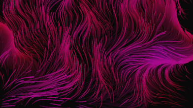

# Starfield (wallpaper for Lively)
Particles (or stars) flowing smoothly and endlessly in a Perlin Noise field. Very customizable.

[Download the ZIP file](https://github.com/HaLo2FrEeEk/Starfield-wallpaper-for-Lively/releases), drop it into Lively.
